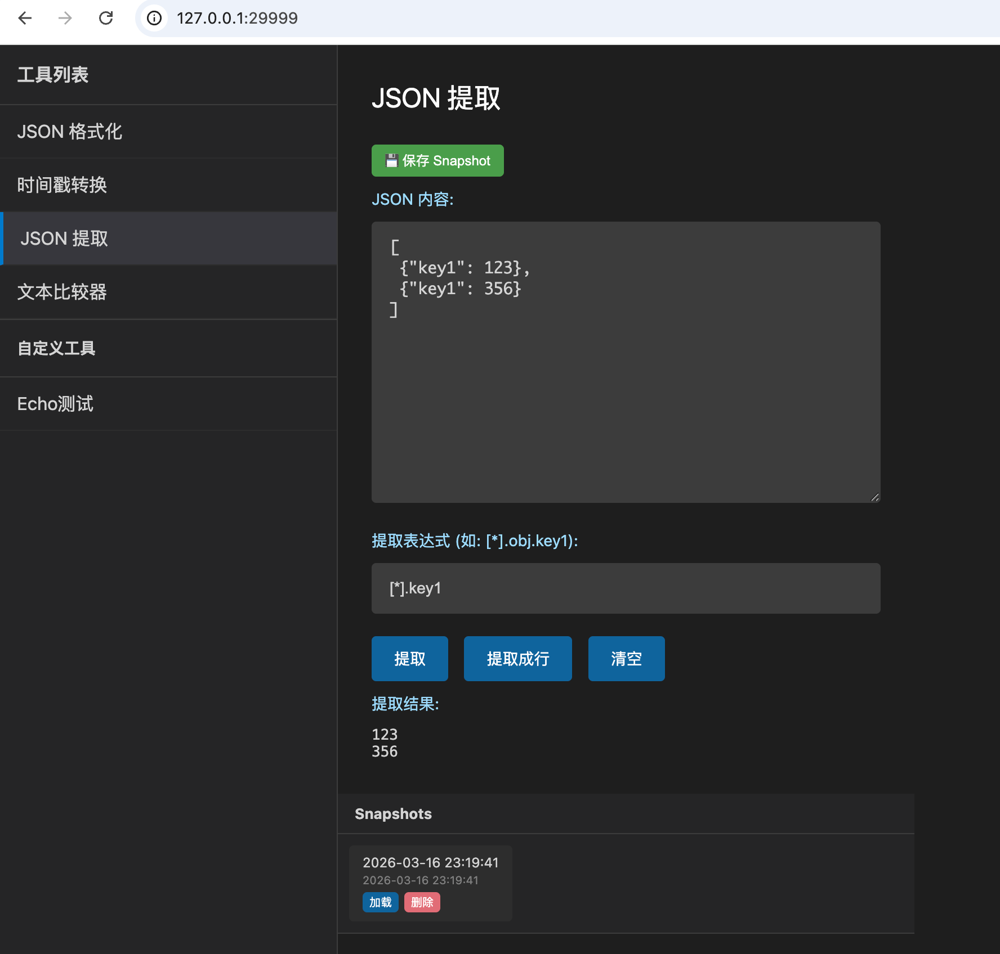

# 开发者工具箱

一个轻量级的开发者工具箱，提供常用的开发辅助功能，无需安装，直接运行。



## 功能特性

### 1. JSON 格式化
- 支持 JSON 格式化和压缩
- 语法高亮显示
- 一键复制结果

### 2. 时间戳转换
- 支持秒级和毫秒级时间戳
- 时间与时间戳互转
- 一键获取当前时间戳

### 3. JSON 提取
- 支持路径表达式提取 JSON 数据
- 支持 `[*]` 遍历数组
- 支持 `[n]` 获取指定索引
- 支持 `.key` 访问对象属性
- 提取结果支持 JSON 格式和逐行显示

示例：
- 输入 JSON：`[{"name": "test", "value": 1}, {"name": "test2", "value": 2}]`
- 表达式：`[*].value`
- 结果：`[1, 2]`

### 4. 文本比较器
- 智能 diff 算法
- 绿色显示新增内容，红色显示删除内容

### 5. URL 编解码
- 支持 URL 编码和解码
- 一键完成转码

### 6. 字符串转义
- 支持特殊字符转义
- 处理引号、反斜杠等

### 7. JSON Key 命名
- JSON Key 命名风格转换
- 支持驼峰、下划线等常见命名格式

### 8. CSV 表格
- 表格编辑：直接编辑单元格内容
- 文件操作：打开 CSV 文件、保存修改
- 差异预览：修改后保存前显示变更预览
  - LCS 算法计算行列差异
  - 颜色区分：绿色新增、红色删除、橙色修改

### 9. Base64 编解码
- 支持 Base64 编码和解码
- 一键完成转换

## 自定义工具

### 10. 自定义工具
- 支持在 `diy_tools` 目录添加自定义工具
- 每个工具通过 JSON 文件配置
- 同一分组下的多个工具可以写在一个 JSON 文件中

#### 配置格式

在 `diy_tools` 目录下创建 JSON 文件，格式如下：

```json
{
    "group_name": "分组名称",
    "tools": [
        {
            "name": "工具名称",
            "fields": [
                {
                    "field_name": "参数名称",
                    "field_type": "text"
                }
            ],
            "cmd": "/可执行程序路径"
        }
    ]
}
```

#### field_type 选项
- `text`：多行文本框（默认）
- `row`：单行输入框

## 快速开始

### 构建

```bash
go build -o devtools .
```

### 运行

```bash
./devtools
```

服务启动后访问 http://localhost:29999

## 项目结构

```
dev_tools/
├── main.go          # Go 后端代码
├── static/
│   └── index.html   # 前端页面
├── diy_tools/       # 自定义工具配置
├── resources/       # 资源文件
├── snapshots.json   # 快照数据（自动生成）
└── devtools         # 编译后的可执行文件
```

## 技术栈

- 后端：Go (标准库 net/http)
- 前端：原生 HTML5 + CSS3 + JavaScript
- 无外部依赖
